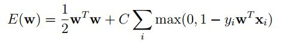
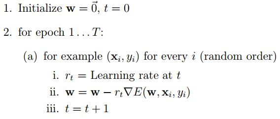
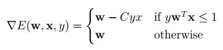

## Support Vector Machine implementation

To create my SVM, I built on my Perceptron implementation but modified the update condition and update process with stochastic sub-gradient descent. An SVM learns a classifier by minimizing this loss function (note: bold-face denotes vectors):

C is a hyper-parameter that controls the importance of the first term relative to the second (error) term; x is a vector full of real numbers, and y is a negative or positive label.

Stochastic Gradient Descent (SGD)
SGD is like traditional gradient descent, except the gradient is calculated using only a single example. 

The gradient is defined in the following way:

The learning rate r is a function of the initial learning rate, ρ0, and the example number, t.

## Data

The training and test data sets I used are in the data0, data1, and astro folders. The data0 and data1 folders contain files with the following naming convention: trainI.K and testI.K, where K represents the number of features in each data point. So for instance, train0.10 is a training set in data0 with 11 features (ten features, plus a constant bias feature) and the corresponding test data set is test0.10. The astro folder contains original and scaled data in the same format as data0 and data1. Each row in each file is a single example and the format of the each row in the data is:

[label] [index1]:[value1] [index2]:[value2] ...

<label> refers to the label for that example. The rest of the row is a sparse vector representing the non-zero values in the feature vector. For example, if the original feature vector is [0, 0, 1, 2, 0, 3], this would be represented as 3:1 4:2 6:3.
